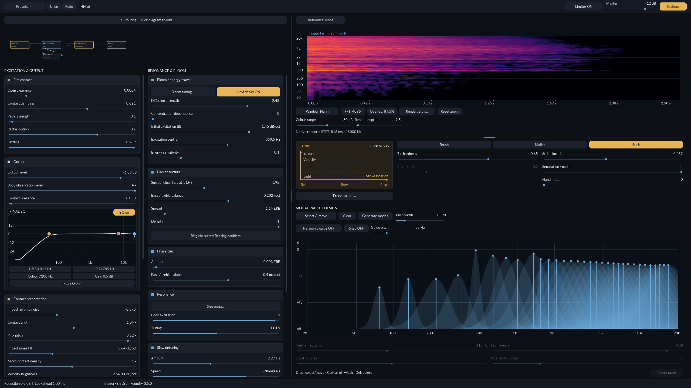

# TriggerFish DrumFoundry

A percussion synthesizer for shaping drum hits, metallic shimmer and evolving
resonance. Available as a CLAP plugin and standalone application for Windows,
Linux and macOS.

**0.5.0 · Development preview** — [User manual](docs/manual.md) ·
[Changelog](CHANGELOG.md)

Play from MIDI or the strike pad, draw and tune resonances, shape their decay,
and add beating, shimmer and bloom. The resizable editor includes graphical
output EQ, undo/redo, user presets and optional reference-sample comparison.
An output limiter provides switchable protection with 1 ms lookahead.

## Included presets

| Preset | Status |
|---|---|
| Hi-hat | Provisional fit with continuous pedal opening and a closing chick, controlled by slider or MIDI CC4. |
| Kick | Provisional fit. |
| Snare | Provisional fit. |
| Crash | Provisional fit; needs more work. |
| Gong | Provisional fit; needs more work. |
| Ride | Needs further tuning and refinement. |

## Get started

Preview packages are available from successful runs on the
[builds page](https://github.com/JTriggerFish/TriggerFish-DrumFoundry/actions/workflows/ci.yml).
Choose the **UI** artifact for your platform; it includes the standalone and
CLAP plugin. Packages are unsigned.

Open the standalone, choose **Settings → Audio / MIDI settings…**, select your
devices and click **Apply & start**. Choose a sound from **Presets → Factory**
and play the strike pad or your MIDI controller. Windows supports ASIO and WASAPI.

For a DAW, install the `.clap` plugin in its CLAP search folder and load
DrumFoundry on an instrument track. See the [user manual](docs/manual.md) for
sound design, pedal control and keyboard shortcuts.

Building from source: [build instructions](DEVELOPMENT.md).

## Licence

[GNU GPLv3](LICENSE.txt). Third-party components retain their respective licences.
